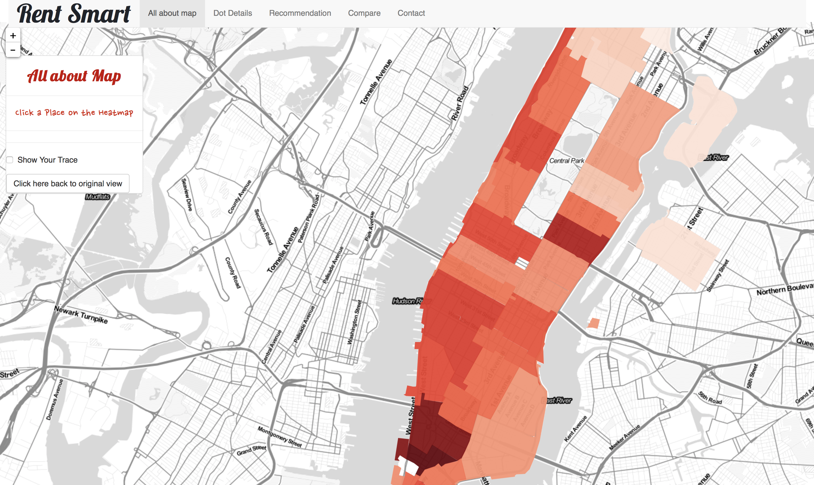

# Project 2: Open Data App - an RShiny app development project

## Project Title： Rent Smart
Term: Spring 2018


+ Team #3
+ **Projec title**: [Rent Smart](https://corgi.shinyapps.io/rent_smart/)
	+ Wanting Cui
	+ Xueying Ding
	+ Hanying Ji
	+ Yu Tong
	+ Xiuruo Yan

+ **Project summary**: 



This app provides a platform for New Yorkers to search house rental information based on their own preferences. We take price, house types, all kinds of amenities and safety into consideration.

On “All about map” page, users will get a first impression on rental prices in Manhattan, the redder the more expensive. Move mouse and click regions they are interested in, they will get basic information about it. We also give users option to keep track of their choices. 

On “Dot Details” page, users can view all dot details and select kinds of amenities according to their preferences to roughly inspect what's the distribution of the things they consider most. 

On “Recommendation” page, tables will list data in those regions recommended by the app basing on users' selection while small map will show these regions. When they click “View Compare” button, they can view stacked bar plot on next page and learn difference in regions and components.

On "Compare" page, stacked bar plots are displayed.


+ **Contribution statement**: ([default](doc/a_note_on_contributions.md)) 
+  Data acquisition and cleaning: everyone
+  Summarised and combined acquitted data into one csv file (rank_all.csv): Wanting Cui (mostly), Xueying Ding
+  UI Design: Xiuruo Yan
+  Server- Heat Map: Hanying Ji (mostly), Yu Tong, Xiuruo Yan
+  Server- Dot Position: Yu Tong (mostly), Xiuruo Yan
+  Server- Recommendation: Wanting Cui (mostly), Xiuruo Yan, Yu Tong
+  Server- Compare: Xueying Ding (mostly), Wanting Cui
+  Server- Contact: Xiuruo Yan 
+  Debug help: Yu Tong

All team members approve our work presented in this GitHub repository including this contributions statement.


Following [suggestions](http://nicercode.github.io/blog/2013-04-05-projects/) by [RICH FITZJOHN](http://nicercode.github.io/about/#Team) (@richfitz). This folder is orgarnized as follows.

```
proj/
├── app/
├── lib/
├── data/
├── doc/
└── output/
```

Please see each subfolder for a README file.

